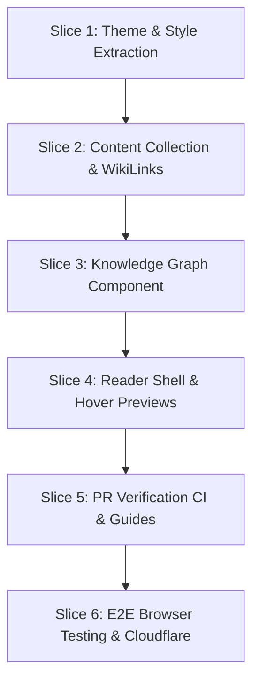

# ADR 0002: AI Soc Corpus Architecture and Development Plan

## Status
Proposed (Pending User Ratification)

## Context
The NUS AI Society (AISoc) requires an educational corpus that helps motivated members achieve good proficiency in modern machine learning concepts, bootstrapping beginners faster than university curricula. The system must feel premium, visual, highly navigable, and support complex LaTeX and code blocks.

We need to resolve several uncertain points in the brief:
1. **Organisation of Material**: Balancing rigid hierarchies against unstructured semantic maps.
2. **Markdown Wiki-Link Resolution**: Organizing note connections like Obsidian.
3. **Contribution System & PR Flow**: Making it easy yet rigorous for beginners to contribute without content degradation.
4. **Style Transfer**: Copying typography, colors, and layout from `NUSAISoc/aisoc-website`.
5. **Hosting Plan**: Finding a free, performant host supporting custom builds.

---

## Resolved Decisions & Answers to Uncertain Points

### 1. Organisation of Material: The Hybrid Knowledge Graph
Instead of a boring flat hierarchy or a chaotic, unguided semantic web, we will implement a **Hybrid Knowledge Graph**:
- **Directed Prerequisite Edges (Structural)**: Defined explicitly in page frontmatter (e.g. `prerequisites: ["linear-algebra", "gradient-descent"]`). This forms a Directed Acyclic Graph (DAG) indicating learning paths.
- **Undirected Similarity Edges (Semantic)**: Computed programmatically at build time using the **Jaccard Similarity Index** over shared domains and tags. For any topic $A$ and $B$, their similarity is defined as:
  $$J(A, B) = \frac{|Tags_A \cap Tags_B|}{|Tags_A \cup Tags_B|}$$
  We connect topics whose Jaccard index exceeds a threshold (e.g., $\ge 0.4$), creating a dynamic k-Nearest Neighbors (kNN) discovery network.
- **Interactive Obsidian-Style Visualization**: A React component powered by D3-force rendering an SVG-based, responsive force-directed graph. Users can toggle between **Learning Path View** (prerequisite trees) and **Semantic View** (kNN clusters), click nodes to jump to topics, and hover to see descriptions.

### 2. Obsidian Wiki-Link Parser (`[[Topic Name]]`)
We will create a custom Remark/Rehype transformer plugin that:
- Detects the `[[Topic Slug]]` or `[[Topic Slug | Display Text]]` syntax in markdown.
- Resolves the link dynamically to `/topics/[slug]`.
- Enforces build-time validation: if a `[[WikiLink]]` references a non-existent topic slug, the build fails instantly, preventing broken internal paths.
- **Backlink Extraction**: Scans all markdown content at build time, generating a static backlinks index mapped to each topic, rendered at the bottom of the article.
- **Hover Preview Popovers**: Emits metadata about linked topics so that hovering over a link displays a lightweight, elegant popover showing the target topic's title, difficulty, and summary.

### 3. Welcoming & Welled-Defined Contribution System
To maintain the high-quality, "no-slop" ethos:
- **Editor Suggestions**: Recommend **Obsidian** (free desktop markdown tool) or **VS Code + Foam extension** for local editing, allowing live previewing of WikiLinks.
- **Formatting Standards**: Provide templates for LaTeX (inline `$` and block `$$`), syntax-highlighted code blocks, and citations (defining a `citations` array in frontmatter).
- **Automated Validation (PR Verification)**: Run CI checks on PRs verifying frontmatter structures, KaTeX compile success, image citations, and internal link integrity.

### 4. Styling & Typography Constraints
- Enforce **ccff00** (strict neon lime-green) as the primary accent color.
- Save global styling tokens (such as modern dark radial gradients, strict fonts: **Tomorrow** for headings and **JetBrains Mono** for all body/code text, and core branding colors) in `/src/styles/global.css`.
- Copy or reconstruct key components (Navigation Header, Footer, Brand Logo, and Button designs) matching the aesthetics of `nusaisociety.org`.

### 5. Free Premium Hosting Plan
- **Cloudflare Pages**: Extremely fast, globally distributed, completely free tier. Natively supports Astro builds, integrates with GitHub, offers automatic PR preview deployments, and handles custom domains with free SSL.

---

## Detailed Development Plan (Phases & Vertical Slices)

### Slice 1: Website Style Extraction & Theme Initialization (Completed ✅)
- **Goal**: Initialize the Astro + React project and align typography and colors with the main AISoc website.
- **Tasks**:
  1. **Status**: Fully completed and validated.
  2. **Details**: Global CSS variables, custom dark background radial gradient `--gradient-hero`, Typography (strict **Tomorrow** for headings and **JetBrains Mono** for all body/code elements), and layout classes are defined in `/src/styles/global.css`.
  3. **Components**: The responsive global navigation header (`src/components/Navigation.astro`) and exact official footer (`src/components/Footer.astro` replicating `nusaisociety.org` with strict styling) are fully functional and integrated with `BaseLayout.astro`.

### Slice 2: Content Schema & Custom Markdown Compiler
- **Goal**: Configure Astro Content Collections with frontmatter validation, KaTeX support, and WikiLink resolution.
- **Tasks**:
  1. Define a strict Zod schema for topic files in `src/content/config.ts` (title, description, difficulty, domains, tags, prerequisites, citations).
  2. Integrate KaTeX and Rehype plugins for full LaTeX compilation.
  3. Write a custom Remark/Rehype plugin to parse `[[WikiLinks]]` and build a static `backlinks.json` index at build time.
  4. Write a unit test suite (Vitest) validating the parser, backlink extraction, and link validation.

### Slice 3: Force-Directed Knowledge Graph Component
- **Goal**: Render the interactive Obsidian-style network map in React.
- **Tasks**:
  1. Write a build-time script that computes the Jaccard similarity index and prerequisite DAG relationships, saving them to a static graph data JSON.
  2. Create a React component (`src/components/KnowledgeGraph.tsx`) using D3-force.
  3. Implement zoom, drag, and node-highlight behavior using Tailwind-friendly CSS styles.
  4. Add toggle controls allowing users to switch between the "Learning Path View" and the "Semantic View".

### Slice 4: Premium Reader Layout & Hover Previews
- **Goal**: Create the main topic reading experience with seamless local navigation.
- **Tasks**:
  1. Design a double-pane layout: Sidebar Navigation Outline (left), Topic Content (center), and Backlinks list / floating Graph view (right).
  2. Implement local navigation: auto-highlight active section based on scroll position (ScrollSpy).
  3. Build the `HoverPreview` React tooltip component: asynchronous data retrieval or preloaded topic summaries showing target previews on WikiLink hover.

### Slice 5: Automated Verification CI & Reviewer Guide
- **Goal**: Protect the codebase from degradation using strict automated and manual review gates.
- **Tasks**:
  1. Write a local verification script (`scripts/validate-content.sh`) to perform static checks on frontmatter, LaTeX, citations, and internal links.
  2. Implement a GitHub Actions workflow that runs this validation script on every PR.
  3. Draft `CONTRIBUTING.md` containing formatting rules, tool recommendations, and the manual Reviewer Checklist for CCA editors.

### Slice 6: E2E Verification & Cloudflare Pages Deployment
- **Goal**: Ensure absolute correctness of the interactive site via Playwright and deploy to hosting.
- **Tasks**:
  1. Configure Microsoft Playwright E2E tests (`tests/e2e/`) verifying key user interactions (navigating via graph click, hover previews appearing, KaTeX parsing correctly).
  2. Set up Cloudflare Pages hosting integration with automated git hooks.
  3. Run the complete test manifest verification and aggregate deterministic gates.

---

## Consequences
- **Benefit**: Provides a rigorous, robust, and highly structured framework that guarantees educational material quality while offering a gorgeous, premium, visual-first interactive UX.
- **Tradeoff**: Creating custom Remark plugins and interactive SVG graphs requires careful performance tuning to avoid slow builds or browser lag.
