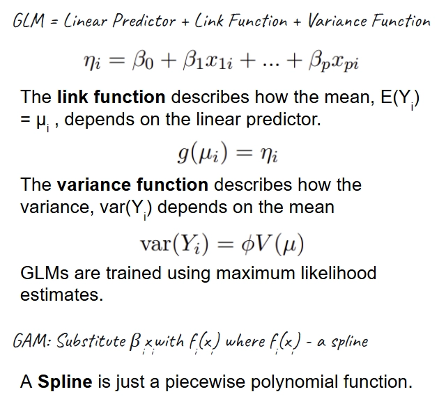
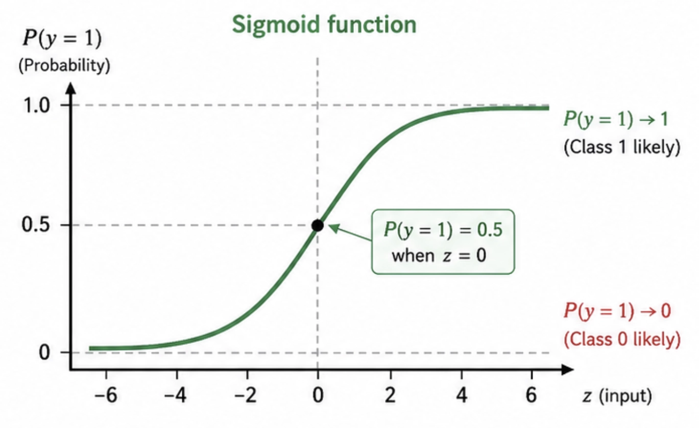
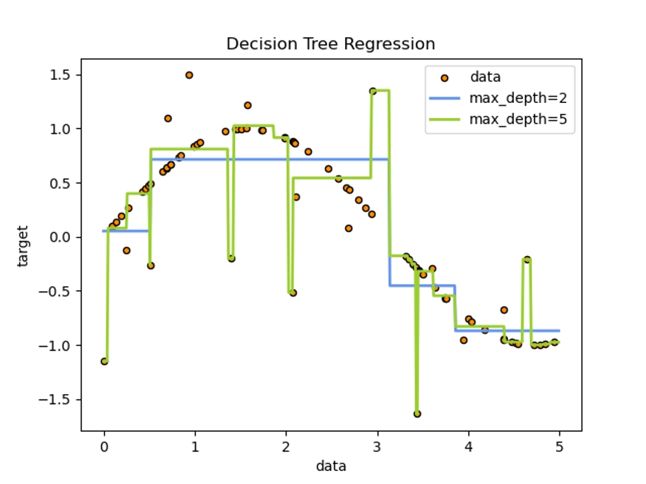
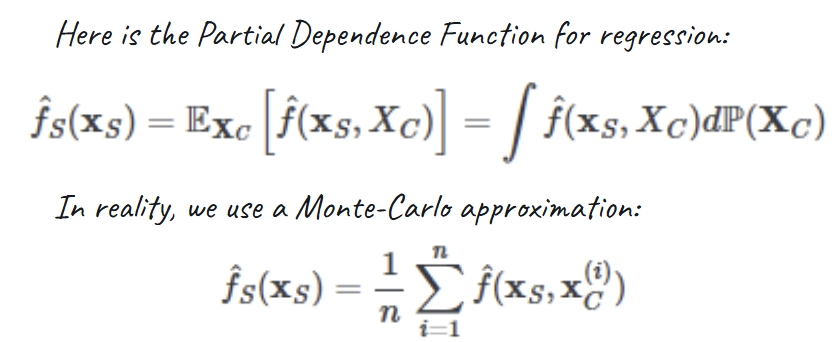
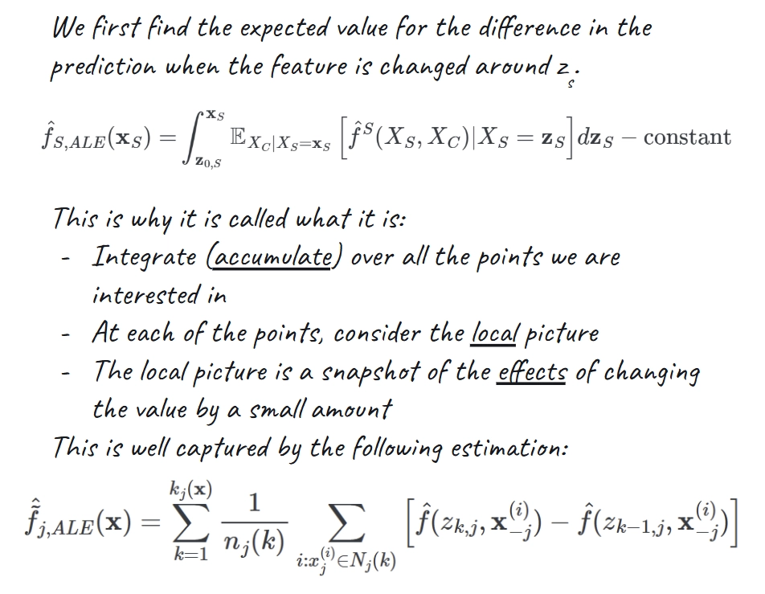

## What does it mean to interpret?

We say that AI is a black-box because we don’t know why the model made a certain decision. For example, we can’t directly understand in human terms why an image classifier identified an image of a handwritten “7” as a 7.

So we need a set of special techniques to unearth model behaviour. These special techniques are interpretability. Interpretability is the practice of making a model's behaviour understandable enough for a human to debug it, trust it, reject it, or explain its limits.

## Classical Interpretability

Classical interpretability is the simplest approach to understanding model behaviour. It starts from a simple question: can we understand either the model itself or a useful approximation of its behavior?

The techniques below fall into two broad families:

1. **Intrinsic interpretability**: use a model whose parameters or structure are already meaningful.
2. **Post-hoc interpretability**: explain a fitted model after training, often without requiring access to its internal weights.

We are going to go through each method in turn.

Classical methods are the simplest approaches out there. They are not state of the art but they remain useful, even when the final model is a black box such as a [[neural-networks|Neural Network]] or [[support-vector-machines|Support Vector Machine]]. They are good as baselines or sanity checks.

## Intrinsically Interpretable Models

### Linear Regression

[[linear-regression|Linear Regression]] predicts a continuous value from a weighted sum of features. Under the right assumptions, each coefficient gives a direct estimate of how the prediction changes when that feature increases while other features stay fixed.

This makes linear regression a useful interpretability baseline, but the explanation is only as valid as the assumptions behind the model. It turns out that there are a lot of assumptions that a dataset must adhere to for linear regression to be applicable. [[linear-regression|Linear Regression]] explains these assumptions.

### GLMs, GAMs, and Beyond

Remember the assumption for linear regression? There are a lot of situations where these assumptions are violated. This is why techniques exist to handle just these situations.

This is how we can deal with situations where assumptions are violated:

- Non-linear: Transform features (eg: regression after logarithm)
- Not normally distributed: Use a **Generalised Linear Model (GLM)**
- Non-linear: Use a **Generalized Additive Model (GAM)**

Generalized Linear Models (GLMs) extend linear regression by combining a linear predictor with a link function and a probability distribution for the target.

This allows us to work with datasets that might not be normally distributed. We can choose the link function in accordance to our best guess of the distribution of the dataset, and we will end up with all the best properties

Generalized Additive Models (GAMs) are simpler. All they do is relax the strict linear feature effect by replacing the linear term $\beta_i x_i$ with a spline $f_i(x)$. Now don’t be scared about the word “spline”: its just a fancy way of saying it a function that is made up of a bunch of polynomials put together. More precisely, it is a “piecewise polynomial function”.

But when this substitution is done, the general GAM looks as follows:

$$
g(\mathbb{E}[Y]) = \beta_0 + f_1(x_1) + f_2(x_2) + \cdots + f_p(x_p)
$$

The key tradeoff that GAMs balance well is their ability to show non-linear effects while keeping the model additive enough to inspect them feature-by-feature. This is a trade-off that recurs throughout the study of classical interpretability techniques: making a model more powerful makes it harder to understand what is going on.

Hastie and Tibshirani introduced GAMs in Generalized Additive Models. This is a good read to get started with the formalization of GAMs.

### Logistic Regression

In linear regression, we fit a linear function to the data. In logistic regression, we fit a logistic function to the data. Don’t worry if you don’t recognize the name “logistic”: it is the same as a sigmoid function. Here is what it looks like:

Logistic regression is a GLM for binary classification. The linear predictor is the log-odds of an event. It turns out that this is the link function for a binomial distribution.

$$
\log \frac{p}{1-p} = \mathbf{w}^\top \mathbf{x} + b
$$

The coefficients explain how each feature shifts log-odds (remember in linear regression the coefficient gives how much the outcome changes; well here the coefficient gives how much the log odds change). Not convinced?

This is interpretable, but it can be easy to overstate the meaning of a coefficient if features are correlated or the decision boundary is not close to linear. So again, caution needs to be applied because the dataset might not satisfy the assumptions we need.

### Decision Trees

A decision tree is just what the name says. It is a tree that you navigate by taking a set of decisions. Depending on the decision you take, you go down a particular branch. The final outcome is the leaf you end up in.

This path-based explanation is often more intuitive than a vector of coefficients. This makes it a really useful complementary technique for interpretability, suitable for applications where looking at a **sequence of decisions** might be invaluable.

For now, we won’t go into how decision trees are trained: the discuss would go off on a tangent. But there are some very clever tricks that are worth checking out in the training process.

They have a weakness however: small data changes can produce a different tree, and deep trees can become too large to interpret. Pruning, shallow depth limits, and validation checks are necessary if the tree is meant to be an explanation rather than only a predictor.

If we are doing decision tree regression (yes decision trees can be used for regression as well), it is possible to visualise a clear **decision boundary**! This is more useful for larger trees. Here is a visual for a simple tree from scikit learn's documentation.

## Global Feature Effect Methods

### Partial Dependence Plots (PDP)

Partial Dependence Plots give a statement about the global relationship of a feature with the predicted outcome. It is similar to a marginal distribution: we integrate out the effect of the other features. However, in reality we use a Monte-Carlo approximation of the integral.

The resulting plot shows the average predicted response as one or two features vary while the other features are averaged over the dataset. In general, PDPs are useful for global trends.

However, they have a key failure mode. This main failure mode is correlated features. If we vary one feature while holding the rest to combinations that rarely occur in real data, the plot may describe unrealistic inputs rather than model behavior in the data distribution.

### Individual Conditional Expectation (ICE)

Now we look at a local technique to see how it may help us ward off the effect of dependence. This is also a basic, common-sense interpretability technique. Individual Conditional Expectation (ICE) plots are like PDPs without averaging. Instead of one global curve, an ICE plot draws one curve per observation.

PDP is global because it averages over all feature values for the other feature to deduce the effect of one feature. ICE is local because we keep all other parameters fixed and just vary one feature to see how the prediction changes.

Goldstein, Kapelner, Bleich, and Pitkin introduced ICE plots in Peeking Inside the Black Box.

ICE is useful when different groups of examples respond differently to the same feature. If every ICE curve has the same shape, the PDP is probably summarizing the effect well. If the curves diverge, the average PDP may be hiding interactions or subpopulation behavior.

### Accumulated Local Effects (ALE)

Let’s try to solve the problem that PDP faces when there is correlation between features (which creates unrealistic data points).

We *could* try to average over only the values near the target (called an M-Plot). However, this means the prediction can’t be attributed to one feature anymore.

ALE solves this by calculating differences instead of averages. It studies how the prediction changes as the feature changes, leading to a more robust interpretation. This is great because we don’t expect the feature to make sense for all *possible* values. We are only moving in a small window.

Apley and Zhu propose ALE as an alternative to PDPs that is less vulnerable to extrapolation when features are dependent in Visualizing the Effects of Predictor Variables in Black Box Supervised Learning Models.

## Surrogate and Attribution Methods

### Surrogate Models

A global surrogate is a model that is:

- Interpretable
- An approximation of the predictions of the underlying model

Surrogates should always be judged by fidelity: how well does the surrogate match the original model in the region being explained? A simple surrogate with poor fidelity is not an explanation of the black box. It is only a separate simple model.

We can train a global surrogate model using features and predictions of the model we want to study. However, sometimes, we want a detailed interpretation of a specific, complex decision. This is where local surrogates come in.

This brings us to our first industry-staple interpretability technique: LIME.

### Local Interpretable Model-Agnostic Explanations (LIME)

LIME trains an interpretable model on a dataset weighted by the proximity of sampled instances to the instance of concern. This corrects for the concern that comes with dependence between features. Unlikely feature values are given low weights, so they don’t matter so much.

Ribeiro, Singh, and Guestrin describe LIME as learning an interpretable model locally around a prediction in "Why Should I Trust You?". This is a good read to get acquainted with the basics of interpretability.

In this paper, the model that LIME produces is described as being the result of optimizing on the following objective function:

$$
\operatorname*{arg\,min}_{g}\ \mathcal{L}(f,g,\pi_x) + \Omega(g)
$$

The first term measures the **fidelity** of the explanation (*locality aware loss*) while the second is a **complexity measure**. We can use multiple approaches to measuring model complexity including number of non-zero weights or the depth of the decision tree.

The resulting explanation from LIME is usually a small set of important features for one prediction. LIME is flexible and model-agnostic, but it can be unstable when perturbation strategy, random seed, kernel width, or interpretable representation changes.

### SHAP

The idea of Shapley values originates from Game Theory. The goal is to fairly distribute a total payout among players by calculating each player’s average marginal contribution.

The Shapley value $\varphi_i(v)$ measures player $i$’s average marginal contribution to every possible coalition, weighted by the number of ways each coalition can occur. Here is the expression (but don’t worry, you don’t need to understand what it means):

$$
\varphi_i(v)=\frac{1}{n!}\sum_{S \subseteq N \setminus \{i\}}|S|!\,(n-|S|-1)!\left[v(S \cup \{i\}) - v(S)\right].
$$

Now the reason Shapley values are so popular is that it has been proven to be the only set of values that satisfies:

- Local Accuracy
- Missingness
- Consistency

These results are central to Shapley values because these properties make a method suitable for human interpretation.

SHAP uses ideas from Shapley values to assign each feature an attribution for a prediction. Lundberg and Lee present SHAP as a unified framework for additive feature attributions in A Unified Approach to Interpreting Model Predictions. This paper is very important in the field of Explainable AI because this is an example of unification where multiple techniques are brought under one framework.

SHAP is popular because it gives local feature attributions and can be aggregated into global summaries. The cost is that exact Shapley values are expensive, so practical SHAP variants use assumptions or approximations.

However, these approximations are often a gold standard. So classical interpretability usually comes down to using SHAP. Here is an overview of some of the different libraries you can use to compute SHAP values:

- Shap (python): https://github.com/shap/shap
- Captum (PyTorch): https://github.com/meta-pytorch/captum
- Shapiq (python) [although this is focused more on Game Theoretic ML]: https://github.com/mmschlk/shapiq

## Choosing a Technique

| Goal                                     | Good starting point         | Watch out for                                       |
| ---------------------------------------- | --------------------------- | --------------------------------------------------- |
| Explain a simple regression model        | Linear regression           | Correlated features and outliers                    |
| Explain probabilities or counts          | GLMs or logistic regression | Coefficients operate through a link function        |
| Show non-linear but inspectable effects  | GAMs                        | Hidden interactions if the model is too additive    |
| Give a path-style explanation            | Decision trees              | Deep trees stop being readable                      |
| Inspect global feature trends            | PDP                         | Unrealistic feature combinations                    |
| Find heterogeneous effects               | ICE                         | Too many curves can become unreadable               |
| Handle correlated feature effects better | ALE                         | Less intuitive interpretation                       |
| Explain a black-box model globally       | Global surrogate model      | Poor fidelity outside simple regions                |
| Explain one black-box prediction         | LIME or SHAP                | Instability, approximations, and feature dependence |

## Related Topics

Classical interpretability builds on [[linear-regression|Linear Regression]] and connects to optimisation through [[gradient-descent|Gradient Descent]]. These techniques are commonly used to inspect complex predictors such as [[neural-networks|Neural Networks]] and [[support-vector-machines|Support Vector Machines]].
