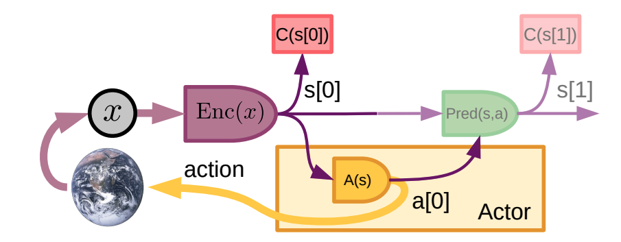
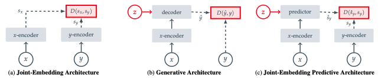
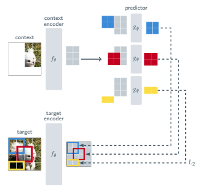
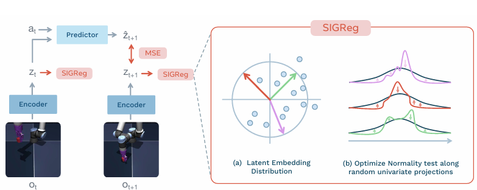

## Motivation Behind JEPA

In his 2022 proposal for autonomous machine intelligence, Yann LeCun argued that modern machine-learning systems remain far less sample-efficient and adaptable than humans and animals. He proposed that intelligent machines need world models: internal models that represent the state of the world and predict how it may change. Such models could allow an agent to anticipate consequences rather than learning every behaviour through direct trial and error.

The figure below illustrates this broader agent architecture. An encoder maps an observation to an internal state, an actor selects an action, and a predictor estimates the resulting next state. The diagram motivates the role of latent prediction in an intelligent agent, although it is not itself the JEPA training architecture.

Predicting the world directly in pixel or waveform space is difficult because observations contain large amounts of detail that may be irrelevant or inherently unpredictable. A reconstruction-based model must still devote capacity to these details. LeCun therefore proposed predicting in an abstract representation space, where an encoder can preserve the important and predictable properties of the target while discarding unnecessary variation. JEPA is the framework proposed for learning these representations and their predictive relationships.

## What Is JEPA?

A Joint-Embedding Predictive Architecture is a self-supervised learning framework in which a model predicts the representation of a target from related context. The context and target may be different regions of one image, different moments in a sequence, or other related signals. JEPA is therefore not one fixed neural-network architecture, but a general way of constructing and training predictive models.

The figure below compares JEPA with two related approaches. A joint-embedding architecture separately encodes two related inputs and encourages their representations to be compatible. A generative architecture instead decodes a representation to reconstruct a target in the original input space. JEPA extends the joint-embedding approach with a predictor that estimates the target representation from the context representation.

$$
s_x=f_\theta(x), \qquad s_y=f_\xi(y), \qquad \hat{s}_y=g_\phi(s_x,z)
$$

$$
\mathcal{L}_{\mathrm{pred}}=D(\hat{s}_y,s_y)
$$

Here, $f_\theta$ is the context encoder, $f_\xi$ is the target encoder, and $g_\phi$ is the predictor. The optional conditioning variable $z$ specifies what should be predicted, such as the location of a masked image region or an action applied to the current state. The discrepancy $D$ is measured in the target encoder's representation space rather than against the raw target. Prediction loss alone can permit trivial, uninformative solutions, so practical JEPA methods also require a mechanism for preventing representation collapse.

### Image-Based JEPA

The first major implementation was Image-based JEPA, or I-JEPA, introduced in 2023. The figure below shows how it predicts the representations of several target image blocks from one shared visible context.

During training, an image is divided into patches and several regions are selected as targets. The context encoder processes only the visible patches, while the target encoder processes the image and supplies the representations of the selected target blocks. The predictor combines the context representations with positional tokens identifying each target location, then minimises the average squared distance between its predictions and the corresponding target representations.

I-JEPA uses relatively large target blocks and a spatially distributed context so that the task cannot be solved only from nearby textures. The context encoder and predictor are updated through gradient descent, while the target encoder follows the context encoder through an exponential moving average:

$$
\xi \leftarrow \tau\xi+(1-\tau)\theta
$$

This slow target update provides a more stable learning signal. After pretraining, the context encoder can be reused or fine-tuned for downstream visual tasks.

## JEPA and World Models

A world model learns how an environment changes, commonly by predicting a future state from the current state and an action. JEPA becomes a latent world model when the context is a history of observations, the target is a future observation, and actions are supplied as conditioning information. If $s_t$ is the encoded observation at time $t$, the dynamics predictor can be written as:

$$
s_t=f_\theta(o_t), \qquad \hat{s}_{t+1}=g_\phi(s_t,a_t)
$$

$$
\mathcal{L}_{\mathrm{dyn}}=D(\hat{s}_{t+1},s_{t+1})
$$

This differs from I-JEPA, which predicts missing regions within a static image. An action-conditioned JEPA instead learns temporal transitions in latent space. The appeal is that planning can operate on compact representations rather than generating complete future images. However, the latent dynamics model does not choose actions by itself; it must be paired with a planner, value function or policy, and its representation must retain information relevant to control.

### LeWorldModel

LeWorldModel (LeWM) is a recent end-to-end JEPA for learning environment dynamics from offline image-action trajectories. A shared encoder maps each observation to a latent state, while a causal, action-conditioned predictor uses previous latent states and actions to predict the next one. Unlike I-JEPA, LeWM trains the encoder and predictor jointly without an EMA target encoder, stop-gradient or a pretrained visual backbone. The figure below summarises this training pipeline.

Its objective contains a next-embedding prediction loss and SIGReg, which encourages the embedding distribution to match an isotropic Gaussian:

$$
\mathcal{L}=\mathcal{L}_{\mathrm{pred}}+\lambda\mathcal{L}_{\mathrm{SIGReg}}
$$

LeWM demonstrates the use of these learned dynamics on PushT, a continuous-control task in which a point agent must push and rotate a T-shaped block until it matches a target pose. The current and goal images are first encoded. A Cross-Entropy Method planner samples candidate action sequences, rolls them forward through the latent predictor, and selects the sequence whose terminal representation is closest to the encoded goal. Only the first actions are executed before replanning from a new observation, following model-predictive control. In the reported PushT experiments, LeWM outperformed PLDM, while its pixels-only variant also surpassed DINO-WM despite DINO-WM receiving additional proprioceptive information.

## Challenges and Limitations of JEPA

The two most general challenges are preventing representation collapse and designing context-target pairs that preserve useful information. Temporal and action-conditioned JEPAs additionally face uncertainty and error accumulation over long rollouts.

### Representation Collapse

Representation collapse occurs when the encoders produce constant or otherwise uninformative representations, allowing the predictor to match its targets without distinguishing between inputs. Collapse can also be dimensional: embeddings may vary but occupy only a small part of the latent space or contain highly redundant features.

I-JEPA and V-JEPA address collapse through asymmetry. Gradients are stopped through the target branch, whose parameters follow the context encoder by exponential moving average. The context encoder and predictor therefore learn against more slowly changing targets. This stabilises training empirically, although the exact theoretical role of EMA and stop-gradient is not fully understood.

A second family of methods constrains the embedding distribution directly. Variance regularisation prevents individual dimensions from becoming constant, while covariance penalties discourage redundant dimensions. LeJEPA and LeWM instead use SIGReg, which encourages the full embedding distribution toward an isotropic Gaussian. The predictive loss determines what information should be predictable, while the regulariser prevents the representation from becoming degenerate.

A third approach uses a separately pretrained and frozen target encoder. SALT first trains a video encoder through masked pixel reconstruction, freezes it, and then trains a student encoder and predictor to estimate its masked latent representations. Because the target space cannot change to accommodate the student, a collapsed student cannot minimise the prediction loss, although the method requires a separate teacher-training stage.

### Prediction Targets and Information Retention

The context-target design determines both the difficulty of the pretext task and the information the encoder is rewarded for preserving. A small target next to visible context may be predictable from local texture alone, while a large target with too little context may be fundamentally underdetermined. The useful regime lies between these extremes: the target should require broader structure while remaining inferable from the context. I-JEPA approaches this by using large target blocks together with a spatially distributed context.

The target encoder also defines what counts as a correct prediction. If it maps two observations to nearly identical embeddings, the predictor is not penalised for ignoring the differences between them. This can be desirable when those differences are nuisance variation, but harmful when they matter downstream. For example, invariance to translation may help image classification, whereas a control model must often preserve an object's exact position and orientation. JEPA therefore learns the abstraction specified indirectly by the target encoder, context-target sampling and training data—not automatically the abstraction required by every later task.

### Uncertain Futures

Uncertainty mainly affects temporal and action-conditioned JEPAs. Even when the current observation and action are known, the next state may not be uniquely determined because important information is hidden, the environment is stochastic, or other agents behave independently. For example, if a moving object disappears behind an obstacle, the available context may support several plausible paths before it becomes visible again.

A standard deterministic predictor must nevertheless return one target representation. It may commit to the most common outcome or produce a representation that lies between several valid futures, without faithfully describing any one of them. Ignoring unpredictable details is useful when they are irrelevant, but it becomes a limitation when different outcomes require different decisions. Probabilistic or latent-variable JEPA formulations instead aim to represent multiple possible future states and their uncertainty, although this is not yet standard in most JEPA systems.

### Long-Horizon Prediction

A temporal JEPA is usually trained to make short-horizon predictions from valid encoded states. During an autoregressive rollout, however, it must consume its own previous predictions:

$$
\hat{s}_{t+k}=g_\phi(\hat{s}_{t+k-1},a_{t+k-1})
$$

This creates distribution shift and compounds error. A simple local model of the rollout error is

$$
e_{k+1}\lesssim L e_k+\delta,
$$

where $e_k$ is the current latent-state error, $\delta$ is the one-step prediction error and $L$ measures how strongly the predictor amplifies state perturbations. When $L$ is near or above one, even small one-step errors can grow substantially over many steps. In PushT, a slight error in the block's predicted position or orientation can change the next contact point, causing later predictions to diverge further.

Model-predictive control limits this problem by planning over a short horizon, executing only the first actions and then replanning from a new real observation. LeWM uses this receding-horizon procedure, which repeatedly resets the rollout to an encoded observation but does not remove the difficulty of tasks requiring long sequences of coordinated actions.
