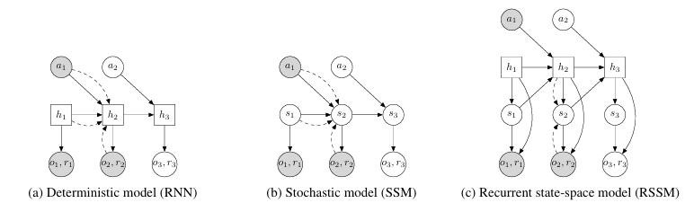
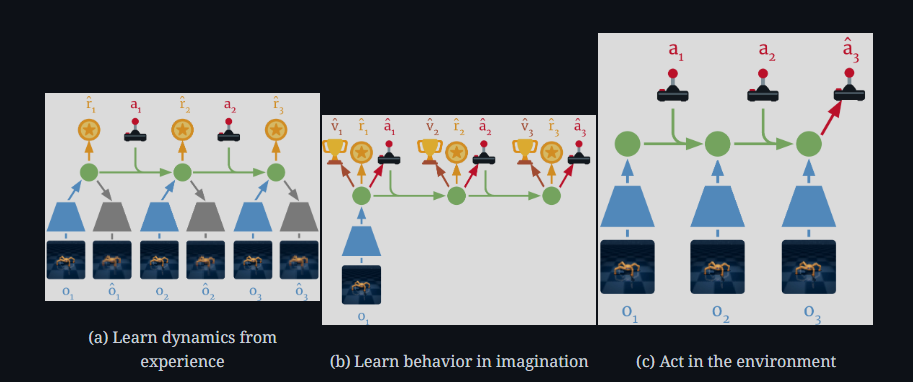
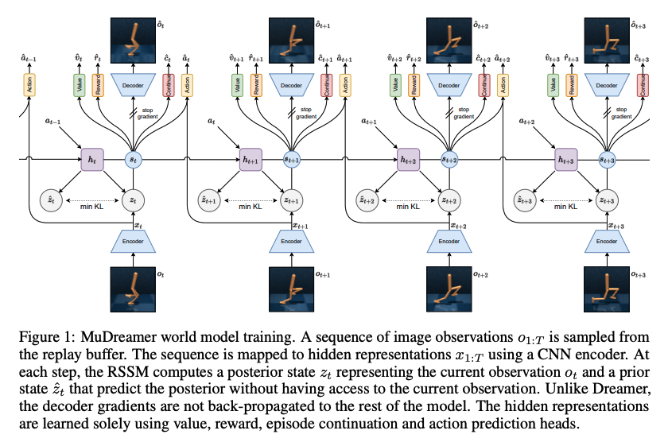
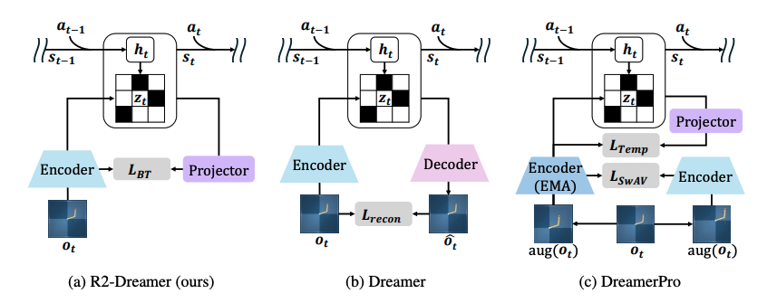

SSMs are deterministic and linear, where given the same previous state and current input, the model will always return the same current state and output. While the hidden state is unknown to observers, it can evolve completely deterministically. In S4 and Mamba, SSMs are just part of a bigger architecture that introduces non-linearity but the forward computation in the SSM portion still normally remains deterministic.

However, most environments are dynamic and uncertain, meaning that the same apparent state and action may not always lead to one definite outcome. This uncertainty may come from randomness in the environment, incomplete observations, or information hidden from the agent. A deterministic model can only map its current state and input to a single next state, making it unable to explicitly represent several plausible futures.

To address this, a **stochastic state-space model** represents the transition as a probability distribution rather than a deterministic function:

$$
s_t \sim p(s_t \mid s_{t-1},a_{t-1})
$$

where $s_t$ is the latent state at time $t$ and $a_{t-1}$ is the previous action. Instead of predicting exactly one next state, the transition model predicts a distribution over possible states and samples $s_t$ from it. The observation and reward are then generated from this sampled latent state:

$$
o_t \sim p(o_t \mid s_t)
$$

$$
r_t \sim p(r_t \mid s_t)
$$

This allows the model to represent multiple possible futures. However, since every transition involves sampling, information that should be remembered reliably over many time steps may be lost or distorted, which affects the model’s ability to store memory of past states. While in theory the model can learn to assign almost zero variance to parts of the state that stores long-term information, the optimisation process in practice may not discover this separation reliably.

The RSSM addresses this problem by splitting the model state into two components: deterministic recurrent state $h_t$ and stochastic latent state $s_t$. The deterministic state provides a reliable way to retain information from previous time steps while the stochastic state allows the model to represent uncertainty and multiple possible futures. In that sense, RSSMs aim to combine reliable memory with probabilistic uncertainty. The deterministic state is updated using an RNN:

$$
h_t=f(h_{t-1},s_{t-1},a_{t-1})
$$

The stochastic state is sampled from a distribution conditioned on the deterministic state:

$$
s_t \sim p(s_t \mid h_t)
$$

The observation and reward models use both parts of the state:

$$
o_t \sim p(o_t \mid h_t,s_t)
$$

$$
r_t \sim p(r_t \mid h_t,s_t)
$$

The stochastic state is hidden and therefore cannot be directly obtained from the environment. RSSM maintains two distributions over it: the prior and the posterior. The prior predicts the stochastic state using only the model’s existing memory, representing what the model expects the current state to be based on previous state and action before observing what happened. The prior can be used to roll the model forward and imagine future trajectories.

$$
p(s_t \mid h_t)
$$

When current observation $o_t$ is available, an encoder instead computes an approximate posterior. The posterior combines the model’s previous knowledge, stored in $h_t$, with new information from the observation, to produce a more informed estimation of the current latent state.

$$
q(s_t \mid h_t,o_t)
$$

## Training Objective

First, an encoder converts the high-dimensional observation $o_t$ into a smaller embedding. The deterministic recurrent state is then updated using the previous deterministic state, stochastic state and action:

$$
h_t=f(h_{t-1},s_{t-1},a_{t-1})
$$

From $h_t$, the transition model predicts the prior distribution:

$$
p(s_t \mid h_t)
$$

Meanwhile, the representation model combines $h_t$ with encoded observation $e_t$ to produce the posterior:

$$
q(s_t \mid h_t,e_t)
$$

During training where real experience is given, the stochastic state is normally sampled from the posterior because the current observation is available. The complete RSSM state is then passed to prediction heads that attempt to reconstruct the observation (Decoder) and predict the reward (Reward head):

$$
o_t \sim p(o_t \mid h_t,s_t)
$$

$$
r_t \sim p(r_t \mid h_t,s_t)
$$

Later Dreamer models (the most well-known application of RSSM in MBRL which we shall cover below) also train a continuation head to predict whether the episode continues:

$$
c_t \sim p(c_t \mid h_t,s_t)
$$

The loss function will usually look something like this:

$$
\mathcal{L}_{\mathrm{RSSM}}=\mathcal{L}_{\mathrm{obs}}+\mathcal{L}_r+\mathcal{L}_{\mathrm{cont}}+D_{\mathrm{KL}}\!\left(q(s_t \mid h_t,e_t)\,\|\,p(s_t \mid h_t)\right)
$$

Observation loss is often the MSE of the reconstructed observation from the posterior latent against the actual observation. Since the reward model predicts the reward associated with the current latent state, the reward loss measures whether the latent state contains information needed to predict immediate consequences relevant to agent objectives. The continuation predictor is binary: 0 if the episode terminates at this observation and 1 if not. Binary cross-entropy is used.

The KL-divergence term can be understood as training the prior to predict approximately the same latent state as the posterior from just the previous states and actions. If prior and posterior agree, the RSSM can make useful predictions even when future observations are unavailable. However, forcing strong agreement between prior and posterior can be damaging because the posterior may be discouraged from encoding useful information that is difficult for the prior to predict. The other three loss terms force the posterior latent to be informative and help avoid representation collapse from the KL term.

Before talking about Dreamer models, it is important to note that Deep Planning Network (PlaNet) is where RSSM was originally introduced for planning in latent space. For each proposed action sequence, the RSSM is rolled forward using its prior since there are no real observations to compute posterior states. PlaNet evaluates an action sequence by adding together the rewards predicted along its imagined trajectory. The action sequence with the highest predicted returns is used to refine the search distribution. Only when a sufficiently promising sequence has been found does PlaNet perform the first action in the real environment. Hence, it is important that the prior is as close a replication of the posterior as possible. For those interested in PlaNet, you can read up on how it addresses latent overshooting caused by training on one-step predictions.

## DreamerV1

DreamerV1 differs from PlaNet in how the agent obtains its behaviour. Instead of searching for actions during every decision, Dreamer trains an actor and critic using trajectories generated inside the learned world model. Dreamer training starts with real experience passing through the encoder and RSSM, producing posterior states $q(s_t \mid h_t,e_t)$, which are used as starting points for imagined trajectories.

Once imagination begins, the actor selects an action from the current latent state. The RSSM predicts the next deterministic and stochastic states, and the reward model predicts the reward. The critic estimates the return expected from each imagined state to evaluate the quality of the state. The actor is trained to choose actions that lead to high imagined returns. DreamerV1 can propagate gradients through the imagined trajectories to improve the actor, allowing the agent to learn from the hypothetical experiences generated by the RSSM.

The world model loss function is as follows: Image reconstruction + Reward prediction + single-direction KL

## DreamerV2

DreamerV2 retains the same broad training process of V1. Its main world-model developments are the introduction of categorical stochastic states and KL balancing. DreamerV1 represents the stochastic state using a Gaussian distribution:

$$
z_t \sim \mathcal{N}(\mu_t,\sigma_t^2)
$$

V2 instead represents $z_t$ using a collection of categorical variables.

$$
z_t=\left(z_t^{(1)},z_t^{(2)},\ldots,z_t^{(K)}\right)
$$

$$
z_t^{(k)} \sim \operatorname{Categorical}\!\left(\pi_t^{(k)}\right)
$$

Each categorical variable selects one value from a finite number of classes and represented by one-hot vector. Combining many categorical variables allows the RSSM to represent a very large number of states. The paper noted that categorical variables are useful for modelling discontinuous or multimodal events. While Gaussian can model such events, discrete variables are better at expressing them more distinctively.

However, hard categorical samples are not differentiable, thus a straight-through gradient estimator is used where $\pi_t$ is the categorical probability vector while $z_t^{\mathrm{hard}}$ is the sampled one-hot state:

$$
\tilde{z}_t=\mathrm{sg}\!\left(z_t^{\mathrm{hard}}-\pi_t\right)+\pi_t
$$

The model receives a discrete state during forward pass while the backward pass allows for gradient flow approximately as if the soft probability vector is used.

Early in the training, the prior is generally inaccurate. If both prior and posterior receive equally strong pressure, the posterior may be simplified towards a poor prior rather than the prior learning accurate dynamics. This makes the original KL term problematic.

DreamerV2 addresses this by separately controlling the two gradient directions:

$$
\mathcal{L}_{\mathrm{KL-bal},t}=\alpha D_{\mathrm{KL}}\!\left[\mathrm{sg}(q_t)\,\|\,p_t\right]+(1-\alpha)D_{\mathrm{KL}}\!\left[q_t\,\|\,\mathrm{sg}(p_t)\right]
$$

The first term freezes the posterior, so only the prior receives the gradient. This encourages the transition model to accurate predict the state inferred after observing what actually happened.

The second term freezes the prior, so only the posterior receives the gradient. This encourages the posterior to avoid storing excess information which the prior cannot predict.

The world model loss function is as follows: Image reconstruction + Reward prediction + Continuation prediction + prior-posterior KL (KL Balancing)

## DreamerV3

Honestly, I didn’t really find the paper interesting and would just make note that it exists so anyone reading who want to learn about it know to look for it. The main contribution of DreamerV3 is to make V2’s RSSM far more general and optimised for more scenarios beyond Atari games.

The world model loss function is as follows: Prediction + Dynamic + Representation. DreamerV3 formally names the KL directions dynamic and representation losses by giving them separate weights and applies free bits.

## MuDreamer

Up until DreamerV3, part of the loss function is a decoder-related loss, usually part of the prediction loss where predicted latents are decoded to actual data and compared. MuDreamer asks whether the world model needs to be able to reconstruct observations at all. While the ability to decode latents helps prevent collapse, it also necessitates modelling unnecessary information. For an image, pixel reconstruction can reduce loss substantially by accurately modelling the large background while neglecting small but important objects.

Thus, MuDreamer removes reconstruction gradients and instead learns the representation by predicting quantities directly related to actions and future rewards. MuDreamer is inspired by MuZero, a Monte Carlo tree search algorithm that predicts control-relevant quantities instead of complete observations. That said, a decoder can be optionally trained for reconstruction and still used as a sanity check.

To reduce collapse risk due to removal of reconstruction, batch normalisation is introduced as collapse prevention. It replaces the hidden normalisation layer inside its representation network with batch normalisation, which standardise each feature across examples:

$$
\mu_j=\frac{1}{B}\sum_{b=1}^{B}x_{b,j}
$$

$$
\sigma_j^2=\frac{1}{B}\sum_{b=1}^{B}\left(x_{b,j}-\mu_j\right)^2
$$

$$
\operatorname{BN}(x_{b,j})=\gamma_j\frac{x_{b,j}-\mu_j}{\sqrt{\sigma_j^2+\epsilon}}+\beta_j
$$

Since batch-level feature statistics are introduced into training, it should prevent all observations from converging to the same constant representation. The MuDreamer paper reported that batch normalisation is good enough to prevent collapse. MuDreamer also covers KL balancing being more delicate because of no reconstruction which you can read up in the paper

The world model loss function is as follows: Reward + Continuation + Value + Action + Dynamic + Representation. Reward and continuation are inherited from previous Dreamer versions and use latent state instead of reconstructed observations. Value prediction encourages the latent state to distinguish states with different long-term outcomes even when the immediate reward is the same. Action prediction asks the model to infer which previous action caused the change leading to the current observation, giving a dense reward signal even when rewards are sparse.

## Redundancy Reduction-Dreamer (R2-Dreamer)

R2-Dreamer builds on DreamerV3 and takes a different approach from MuDreamer. Both aim to be decoder-free, but R2-Dreamer takes this a step further by trying to preserve rich observation information while reducing redundancy. It introduces a self-supervised objective that directly aligns the RSSM state with the observation embedding while reducing redundancy between feature dimensions. Inspired by Barlow Twins, the objective is intended to preserve information, avoid representation collapse, and reduce duplicated information across features.

The encoder converts current observation into an embedding and is passed through the RSSM to obtain the complete RSSM state. R2-Dreamer introduces a lightweight linear projector which maps the RSSM state into the same feature dimension as the observation embedding. Thus, the model has two representations at the same time: a direct representation from current observation $k_{n,j}$ and a representation produced from RSSM state $e_{n,j}$. R2-Dreamer then compares the two representations to encourage the RSSM to preserve information contained in the learned observation features rather than low-level irrelevant details.

However, matching these 2 representations alone can introduce representation collapse where both reach trivial solutions. To avoid certain features from dominating due to having high absolute values, standardisation is introduced to make each feature have approximately zero mean and unit variance.

$$
\bar{k}_{n,i}=\frac{k_{n,i}-\mu_{k,i}}{\sigma_{k,i}+\epsilon}
$$

$$
\bar{e}_{n,j}=\frac{e_{n,j}-\mu_{e,j}}{\sigma_{e,j}+\epsilon}
$$

A cross-correlation matrix is then constructed where each entry compares feature $i$ of the RSSM projection with feature $j$ of the observation embedding.

$$
C_{ij}=\frac{1}{N}\sum_{n=1}^{N}\bar{k}_{n,i}\bar{e}_{n,j}
$$

A value close to 1 means the two features change together strongly. A value close to 0 means they are largely unrelated. Since the goal is for each embedding to store relevant information that are separate from each other, R2-Dreamer tries to make this correlation matrix resemble the identity matrix. The diagonal terms measure the information retention while off-diagonal entries measure redundancy. Hence, the Barlow Twin loss is as follows:

$$
\mathcal{L}_{\mathrm{BT}}=\sum_i(1-C_{ii})^2+\alpha\sum_{i\neq j}C_{ij}^2
$$

The world model loss function is as follows: Barlow Twin + Reward + Continuation + Dynamic + Representation.
