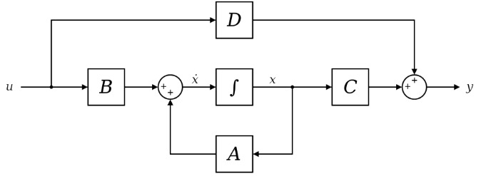
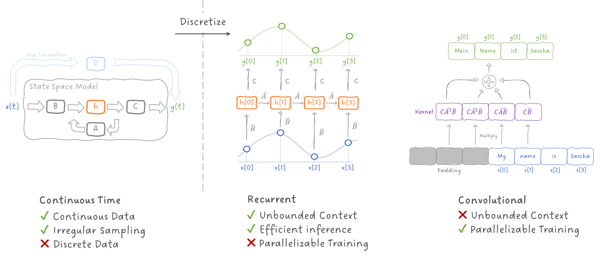
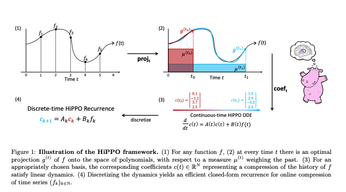

State Space Models (SSMs) aim to predict both how inputs into a system
are reflected in its outputs and how the state of the system itself
evolves over time and in response to specific inputs. SSMs originate
from signal and control theory but found uses as a form of “world model”
that can process input with reference to information from past inputs to
generate the next input.

The **state** of a system is its internal memory: the information it
keeps at time $t$ in order to continue processing the sequence. If the
input sequence is

$$
x_{1},x_{2},\ldots,x_{t},
$$

then the state $h_{t}$ is meant to summarize the useful information from
everything that has happened so far. In a sequence model, the ideal role
of the state is:

$$
h_{t} \approx \text{a compressed summary of }x_{1},x_{2},\ldots,x_{t}.
$$

This means the model does not need to store the entire past explicitly.
Instead, it keeps updating a fixed-size representation as new inputs
arrive. The state is used as a compact way to store memory of the
previous state and should ideally store useful information from past
states while discarding useless information. Since the hidden state is
not directly observable, it is a latent state and SSMs are latent
models.

An SSM's method of handling memory can be treated as the opposite of a
transformer: while the transformer can look at every single token before
the current token to make the next token prediction, an SSM only
references the state and current input to produce an output.

## The Two Magic Equations

The classical continuous-time state space model is described by two
equations:

$$
\dot{h}(t) = Ah(t) + Bu(t)
$$

$$
y(t) = Ch(t) + Du(t).
$$

### The state-update equation

The first equation

$$
\dot{h}(t) = Ah(t) + Bu(t)
$$

describes how the hidden state evolves over time based on internal
dynamics (hidden state) and the input signal.

- $h(t)$ is the hidden state at time $t$.
- $u(t)$ is the input signal.
- $\dot{h}(t)$ is the derivative of the state, meaning the **rate of
  change** of the state.
- $A$ determines how the current state evolves on its own.
- $B$ determines how the new input affects the state.

### The output equation

The second equation

$$
y(t) = Ch(t) + Du(t)
$$

describes how the observable output is produced based on the current
hidden state (Integrate from $\dot{h}(t)$ obtained previously) and input
signal.

- $y(t)$ is the output.
- $C$ reads information from the hidden state.
- $D$ provides a direct path from the input to the output, often
  interpreted as a skip connection.

The $B$ block writes the input into the state dynamics, $A$ governs how
the state evolves, $C$ reads from the state, and $D$ provides the direct
skip path from input to output. Traditional SSMs are continuous-time
models meant to model continuous sequences like signals or trajectories
which is represented by the diagram above.

However, many data modalities processed by modern deep learning are
typically discrete sequences. To use SSM to model a discrete sequence
requires a way to represent distinct timesteps as part of a continuous
signal. We need a way to update the hidden state as shown below:

$$
h_{t} = \bar{A}h_{t - 1} + \bar{B}x_{t}.
$$

## Discretization

Discretization amounts to sampling “snapshots” of the value of a
continuous function at specific moments. Step size is introduced to
determine how long that snapshot is held at each discrete time step.
Common discretization methods include Euler’s method and zero order hold
which is used in Mamba. Suppose time is divided into steps of size
$\Delta$. All continuous changes are summarized into one discrete change
within each step.

Euler’s method:

$$
\dot{h}(t) \approx \frac{h_{t} - h_{t - 1}}{\Delta}.
$$

Substituting into the state equation gives:

$$
\frac{h_{t} - h_{t - 1}}{\Delta} = Ah_{t - 1} + Bx_{t}.
$$

Rearranging gives:

$$
h_{t} = (I + \Delta A)h_{t - 1} + \Delta Bx_{t}.
$$

So the discrete-time matrices become approximately:

$$
\bar{A} = I + \Delta A,\quad\quad\bar{B} = \Delta B.
$$

The step size $\Delta$ controls how much continuous-time evolution
happens in one discrete step. Small $\Delta$ allows for more
fine-grained updates while large $\Delta$ causes more aggressive
compression of continuous evolution into each discrete step.
Interestingly, discretization introduces 2 new representations of SSMs
that are interchangeable: Recurrent and Convolutional.

## Recurrent Representation

Once discretized, the SSM takes the form

$$
h_{t} = \bar{A}h_{t - 1} + \bar{B}x_{t}
$$

$$
y_{t} = Ch_{t} + Dx_{t}.
$$

This is the **recurrent representation**. Conceptionally, this looks
just like a simple RNN where the inputs are processed one at a time,
getting combined into a recurrent hidden state and processed to give an
output.

At every time step:

1.  take the previous hidden state $h_{t - 1}$,
2.  update it using the new input $x_{t}$,
3.  produce an output $y_{t}$.

### Advantages of the recurrent representation

**Efficient inference**: This is the main selling point of the recurrent representation. At inference time, the model only needs the current hidden state rather than the entire past sequence. This makes it memory efficient when generating or processing inputs one step at a time.

**Unbounded context in principle**: Because the state keeps evolving, the model can in principle carry information forward indefinitely. The sequence length is not explicitly capped by a fixed context window in the way a pure finite convolution kernel is.

### Disadvantages of the recurrent representation

**Sequential computation, slower training**: Each step depends on the previous one, so training is harder to parallelize across time. Even if inference is efficient, step-by-step processing can make training less efficient on modern hardware compared with methods that exploit more parallelism.

## Convolution Representation

The same discretized SSM can also be written as a convolution.

Starting from

$$
h_{t} = \bar{A}h_{t - 1} + \bar{B}x_{t},
$$

we can unroll the recurrence. Then the output becomes

$$
y_{t} = C\bar{B}x_{t} + C\bar{A}\bar{B}x_{t - 1} + C{\bar{A}}^{2}\bar{B}x_{t - 2} + \cdots.
$$

This reveals a convolution kernel:

$$
K = \left( C\bar{B},\mspace{6mu} C\bar{A}\bar{B},\mspace{6mu} C{\bar{A}}^{2}\bar{B},\mspace{6mu}\ldots \right).
$$

So the sequence output can be written as

$$
y = K*x.
$$

This is the **convolution representation**. Instead of updating the
state one step at a time, we view the SSM as defining a convolution
kernel over the entire sequence.

Each term

$$
C{\bar{A}}^{k}\bar{B}
$$

tells us how an input from $k$ steps ago influences the current output.

### Advantages of the convolution representation

**Parallelizable training**: Because convolutions over the full sequence can be computed in parallel, this representation is much more friendly to modern accelerators during training. When the whole sequence is available especially during training, the convolution view is often the more convenient computational form.

### Disadvantages of the convolution representation

**Less natural, slower inference**: If inputs arrive one at a time, the convolution form is less natural than simply updating a hidden state and thus have slower inference time.

**Fixed-kernel limitations**: The convolution representation depends on a fixed input-independent kernel. This becomes a limitation when we want content-dependent behaviour, which is one of the motivations for Mamba.

## Why Switching Between the Two Views Matters: LSSL

A major insight in modern SSM work is that the same state-space system
has **three useful views**:

1.  **Continuous-time view** — useful for modelling dynamics and
    irregular sampling.
2.  **Recurrent view** — useful for efficient inference.
3.  **Convolution view** — useful for parallelizable training.

This idea is central to **Linear State-Space Layers (LSSL)**. LSSL
showed that a state-space model can be turned into a practical neural
sequence layer by moving between these equivalent forms.

The same underlying model can enjoy advantages usually associated with
different modelling families:

- **good training** from the convolutional view,
- **good inference** from the recurrent view.

## The $\mathbf{A}$ Matrix

Among all the matrices in an SSM, the **state matrix** $A$ is especially
important.

In continuous time:

$$
\dot{h}(t) = Ah(t) + Bu(t),
$$

$A$ determines how the hidden state evolves even before considering the
new input.

In discrete time:

$$
h_{t} = \bar{A}h_{t - 1} + \bar{B}x_{t},
$$

$\bar{A}$ determines how the previous state is carried into the new one.

So intuitively, $A$ governs the model’s **memory dynamics**. Repeated
application of $\bar{A}$ determines how information from the past
survives over time.

From the convolution form,

$$
K_{k} = C{\bar{A}}^{k}\bar{B},
$$

we can see that older inputs are affected by higher powers of $\bar{A}$.

So the design of $A$ determines whether the model:

- forgets too quickly,
- remembers for a long time,
- captures several timescales,
- represents oscillatory or structured patterns.

A poor choice of $A$ can make the model bad at long-range dependencies.
A good choice of $A$ can give the model strong and stable memory. The
follow-up question is whether there is a way to design A such that models
using these matrices have better memory. Sure enough, some folks at
Stanford came up with a general framework known as High-order Polynomial
Projection Operator (HiPPO).

HiPPO is a method for constructing state dynamics so that the hidden
state represents a compressed approximation of the past signal. Instead
of treating the state as an arbitrary vector, HiPPO gives it a
principled interpretation: the state stores coefficients of a compressed
representation of the history.

Intuitively, HiPPO matrices are able to retain useful information from
more recent states and compress old information. Based on empirical
evidence (E.g. S4 paper), HiPPO provides a more meaningful and effective
choice of memory dynamics, especially through the $A$ matrix. SSMs
perform much better using HiPPO matrix than some random matrix.

Anyone who is good in ODEs can consider looking into the nitty-gritty of
HiPPO and contributing a write-up on it. Here is the diagram from the
paper to hopefully spark interest (they use a Hippo in the paper):

## Structured State Space Sequence Model (S4)

S4’s main significance is that it made SSMs practical for long-sequence
deep learning. It was first introduced in 2022 and generated excitement
since the architecture is different from CNNs and Transformers (Same
year ChatGPT took the world by storm).

S4 can be thought of combining LSSL with HiPPO matrices to produce a
stronger SSM that is trainable, good at inference and have good
performance thanks to math wizardry. S4’s additional contribution is
addressing the issue of matrix A being dense: Generating terms for the
convolutional representation will get expensive if A is dense. If the
state has dimension N, a dense A matrix has $N^2$ entries.

S4 gives A structured form

$$
A = \Lambda - P Q^*
$$

S4 tries to make the A matrix easier to compute by expressing A using a
diagonal part and a low-rank correction. The diagonal part is written
as:

$$
\Lambda = \operatorname{diag}(\lambda_1, \lambda_2, \ldots, \lambda_n)
$$

Diagonal matrices are easy to work with because each state dimension
evolves independently. If A were purely diagonal, then applying A
repeatedly is simple:

$$
\Lambda^k = \operatorname{diag}(\lambda_1^k, \lambda_2^k, \ldots, \lambda_n^k)
$$

This means each hidden-state dimension behaves like its own memory mode.
Some modes can decay quickly, some can decay slowly, and some can
represent oscillatory behaviour. The model then combines these modes to
produce the final output. Different eigenvalues correspond to different
memory behaviours where small magnitudes forget quickly, magnitudes near
one preserve information longer and complex values can represent
oscillations or repeating patterns.

A purely diagonal matrix is efficient, but it can be too restrictive
because each dimension evolves independently. The low-rank term

$$
P Q^*
$$

adds a small amount of richer interaction between state dimensions. It
is not as expensive as a full dense matrix, but it gives more expressive
power than a purely diagonal matrix.

This is the main idea behind the structured matrix:

**A = easy diagonal dynamics + small low-rank correction**

## Limitations of S4

S4 is still mostly based on fixed dynamics. The same state update rule
is applied throughout the sequence:

$$
h_t = \bar{A}h_{t-1} + \bar{B}x_t
$$

This fixed behaviour is what allows the convolution kernel to exist.
However, it also means the model does not directly change its memory
rule based on the content of the current input. This becomes a problem
for information-dense sequences like language. Sometimes the model
should strongly remember a token. Sometimes it should ignore a token.
Sometimes it should overwrite old information. A fixed SSM kernel does
not naturally provide this kind of content-dependent control.

## S5 and Mamba

This section is more to introduce the future developments in the field
of SSM for anyone who want to learn more about SSMs. Developments from
here onwards are complicated enough to warrant their own articles. After
S4, Simplified State Space Layers for Sequence Modeling (S5) is
introduced. It can be understood as a cleaner and more scalable version
of the structured SSM idea.

In S4-style models, the model often uses many separate single-input,
single-output SSMs. Conceptually, each channel of the neural network can
have its own SSM. This works, but it is slightly awkward because modern
neural networks usually operate on feature vectors rather than one
scalar channel at a time.

S5 changes this by using a multi-input, multi-output formulation,
usually shortened to MIMO. Instead of treating each feature channel as
having a separate little SSM, S5 lets a whole feature vector enter one
shared state-space system and reads a whole feature vector out of it.
This makes the SSM layer feel more like a normal deep learning layer. S5
also uses parallel scan algorithms, which I am not knowledgeable about
GPUs enough to actually explain them but just know parallelism in this
case = faster.

Mamba addresses the issue of the memory rule being mostly fixed. A fixed
SSM compresses the sequence through a learned state update but the
compression is mostly the same across positions. Mamba introduces
selective state-space modelling where instead of applying the same
memory rule to every input, let the current input influence how memory
is updated.

The model can learn to decide whether the token should be written
strongly into the state, mostly ignored, used to preserve old memory or
used to overwrite previous information. It allows for different
sequence elements to be treated differently. Think of selective
compression as the compromise between previous iteration’s aggressive
compression and transformer expensive lookup of every single past state.
